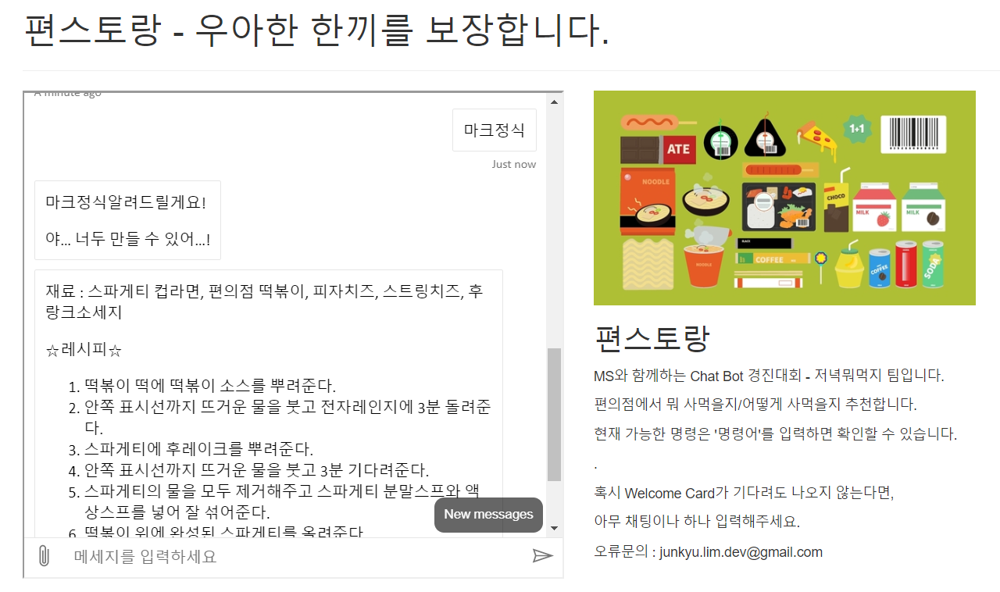

# 편스토랑
매일 외롭게 저녁을 보내는 **당신**...!   
가성비 좋은 **추가 상품**과 누구나 따라할 수 있지만, 아무나 도전하지 않는 **Unique한 레시피**로 편의점에서 레스토랑 못지 않은 우아한 식사를 보장합니다.

## 목적
* 편의점의 합리적인 쇼핑을 위하여 추가 증정 이벤트 등을 모아서 알려주고,  
메뉴를 추천해줍니다.
* Unique하고 Fun한 편의점 레시피를 추천해줍니다.

## 기능 
* 편의점 이벤트 정보 확인(크롤러 이용, 매일 업데이트)
* 최근 많은 좋아요를 받은 메뉴 추천(추천 후, 좋았다 별로였다 확인 가능하도록 구현)
* 특정 메뉴를 고르면 그 메뉴를 기반으로 한 편의점 레시피 추천. or 어떤 스타일의 레시피 추천
* Test in https://fun-staurant.azurewebsites.net/

### 구현 기능
* 편의점 이벤트 정보 확인(크롤러 사용해서 긁어온 정보 셀프 업로드, 크롤러도 호스팅하면 자동화 가능)  
-> CU의 플러스 행사 / 아침애 행사
* 편의점 레시피 추천(유명한 레시피 DB화하여 원하는 레시피 업로드)  
-> 식사 / 음료 / 안주로 나누어 저장. 손쉽게 접근할 수 있도록 함.

### ISSUE
- [x] 크롤러 이용하여 이벤트 상품 추출하기
- [x] json으로 조합법 만들기
- [x] 메뉴 추천 기능
- [ ] 추천 기능을 위해 이어지는 QnA스크립트 만들기
- [ ] (가능하면) GPS기능 이용하여 주변의 편의점 리스트화
- [ ] 위의 기능이 안된다면 지역입력시 편의점 정보 크롤링

### 사용 기술
 - Chat-Bot : Bot Framework / Node.js 
 - QnA-Maker : C#
 - Crawler : Python 
 - Hosting : Azure

## Bot Framework Emulator를 이용한 테스트
**로컬에서 테스트 시 JS모듈과 .env파일이 필요함.** 

[Bot Framework Emulator](https://github.com/microsoft/botframework-emulator)은 봇 개발자가 로컬호스트에서 봇을 테스트하고 디버그하거나 터널을 통해 원격으로 실행할 수 있는 데스크톱 애플리케이션입니다.

- Bot Framework Emulator version 4.9.0버전이나 더 높은 버전은  [여기](https://github.com/Microsoft/BotFramework-Emulator/releases)에서 설치할 수 있습니다.

### Bot Framework Emulator를 이용하여 Local의 봇과 연결하는 방법
- Bot Framework Emulator를 실행합니다.
- File -> Open Bot을 선택합니다.
- 봇의 URL자리에 `http://localhost:3978/api/messages`를 입력합니다.

## 추가자료
### 시연영상 및 코드영상
[시연 영상]()  
[코드 설명 영상]()  
### 관련 Repository
[이벤트 크롤러](https://github.com/What-is-Dinner/-Convenience-Event)  
[웹 서비스](https://github.com/What-is-Dinner/What-is-Dinner-Pages)
## 개발 전략
- Bot Framework의 구조를 Reference를 통해 이해함.
- 개발 간에 기능에 따른 확실한 분업 / 협업을 수행함.
- Git Hub 내의 Issue / Actions등 써보지 못했던 기능들을 적극 채용해봄. (Actions의 Flow는 삭제....)
- Node.js에 대한 첫 도전인 만큼, Node.js에 친숙해질 수 있도록 노력함.
- 깔끔하게 정리된 ReadMe를 통하여 남이 보거나, 이후에 봐도 이해할 수 있도록 함.

## Reference
- [Azure Bot Service 설명서](https://docs.microsoft.com/ko-kr/azure/bot-service/?view=azure-bot-service-4.0)
- [김영욱 멘토님의 Bot Framework Guide](https://github.com/KoreaEva/Bot)
- [Bot Framework Documentation](https://docs.botframework.com)
- [Bot Basics](https://docs.microsoft.com/azure/bot-service/bot-builder-basics?view=azure-bot-service-4.0)
- [Dialogs](https://docs.microsoft.com/en-us/azure/bot-service/bot-builder-concept-dialog?view=azure-bot-service-4.0)
- [Gathering Input Using Prompts](https://docs.microsoft.com/en-us/azure/bot-service/bot-builder-prompts?view=azure-bot-service-4.0&tabs=javascript)
- [Activity processing](https://docs.microsoft.com/en-us/azure/bot-service/bot-builder-concept-activity-processing?view=azure-bot-service-4.0)
- [Azure Bot Service Introduction](https://docs.microsoft.com/azure/bot-service/bot-service-overview-introduction?view=azure-bot-service-4.0)
- [Azure Bot Service Documentation](https://docs.microsoft.com/azure/bot-service/?view=azure-bot-service-4.0)
- [Azure CLI](https://docs.microsoft.com/cli/azure/?view=azure-cli-latest)
- [Azure Portal](https://portal.azure.com)
- [Language Understanding using LUIS](https://docs.microsoft.com/en-us/azure/cognitive-services/luis/)
- [Channels and Bot Connector Service](https://docs.microsoft.com/en-us/azure/bot-service/bot-concepts?view=azure-bot-service-4.0)
- [Restify](https://www.npmjs.com/package/restify)
- [dotenv](https://www.npmjs.com/package/dotenv)
